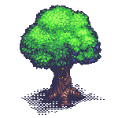

  
  
  
  
  
  
  

      

# Pago
A fun little web based game written in plain Javascript.

*More Coming Soon*

## Screenshots
*Coming Soon*

## Built With 
* [Webpack](https://webpack.js.org/)

## Authors

* **Timon** - *Developer* - [8BitJonny](https://github.com/8BitJonny)
* **Lewe** - *Developer* - [LeweC](https://github.com/LeweC)
* **Fabinc** - *Designer*

See also the list of [contributors](https://github.com/code-smartchain) who participated in this project.

 **Start: 14.06.19**

## License

This project is licensed under the GNU General Public License v3.0
